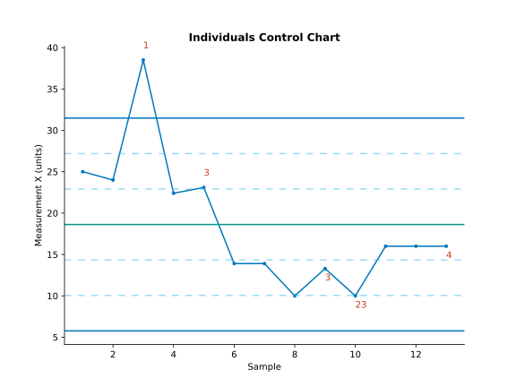
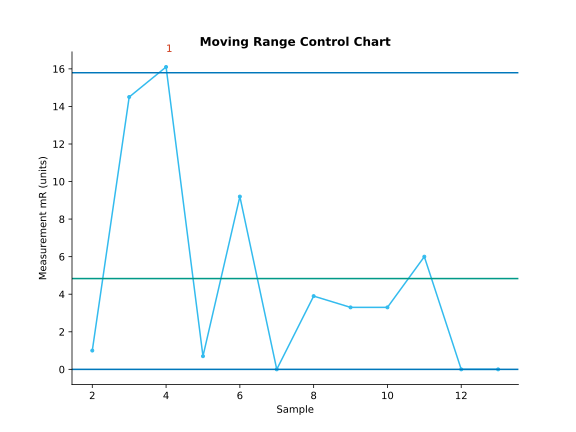
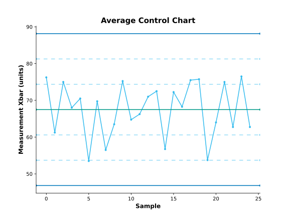
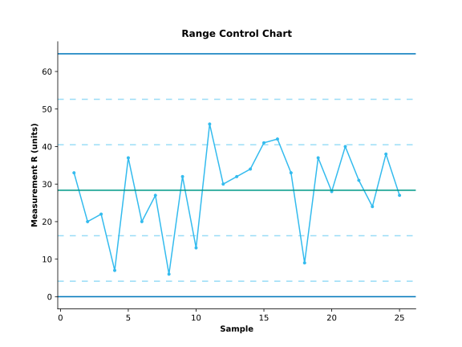
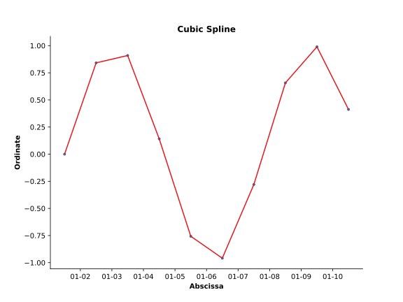
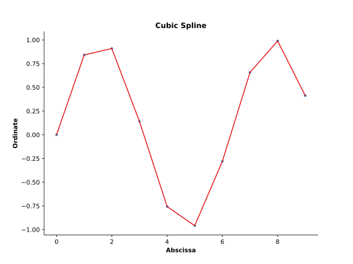
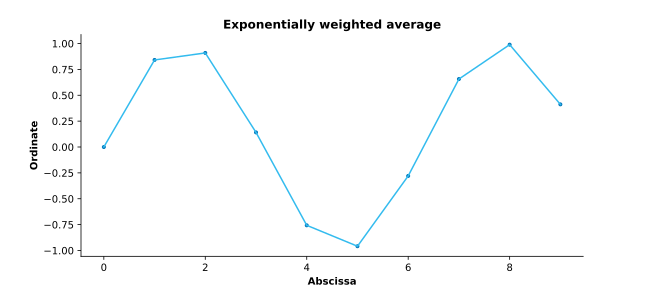
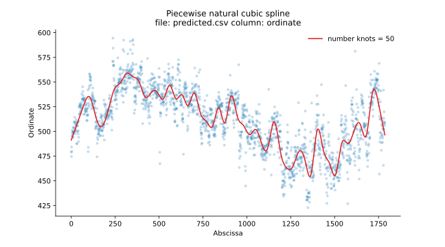

# In brevi

This repository contains a package of statistical and graphical functions
that I use in my work of making sense of data to create information
and understanding.

# To install #

Do this if this is your first-time installation. Ensure you have `git` installed.

```
pip install --user -e "git+https://github.com/gillespilon/datasense#egg=datasense"
```

# To update #

Do this if this is an update anytime after your first-time installation.

```
pip install --user --upgrade -e "git+https://github.com/gillespilon/datasense#egg=datasense"
```

# Examples

In the [scripts](scripts/) directory, there are example scripts and data files.

- [XmR control charts](#xmr-control-charts)
- [XbarR control charts](#xbarr-control-charts)
- [Cubic spline for Y vs X line plot](#cubic-spline-for-y-vs-x-line-plot)
- [Exponentially weighted average for Y vs X line plot](#exponentially-weighted-average-for-y-vs-x-line-plot)
- [Piecewise natural cubic spline](#piecewise-natural-cubic-spline)

## XmR control charts







## XbarR control charts





# Cubic spline for Y vs X line plot





## Exponentially weighted average for Y vs X line plot




## Piecewise natural cubic spline


