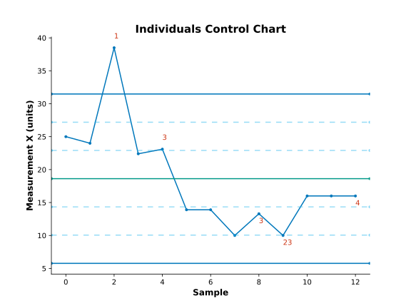
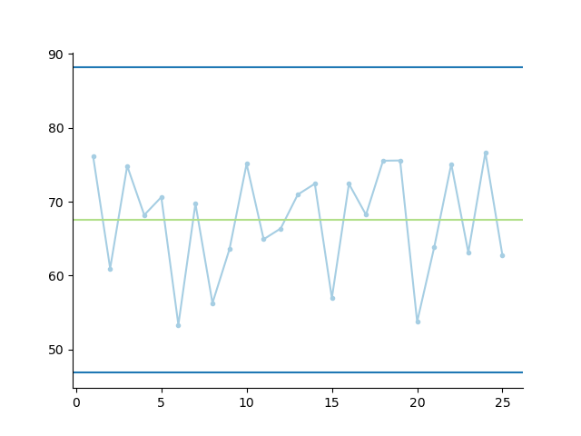

# In brevi

This repository contains a package of statistical and graphical functions
that I use in my work of making sense of data to create information
and understanding.

# To install #

Do this if this is your first-time installation.

```
pip install --user -e "git+https://github.com/gillespilon/datasense#egg=datasense"
```

# To update #

Do this if this is an update anytime after your first-time installation.

```
pip install --user --upgrade -e "git+https://github.com/gillespilon/datasense#egg=datasense"
```

# Examples

In the [scripts](scripts/) directory, there are example scripts and data files.

Here are some plots:





