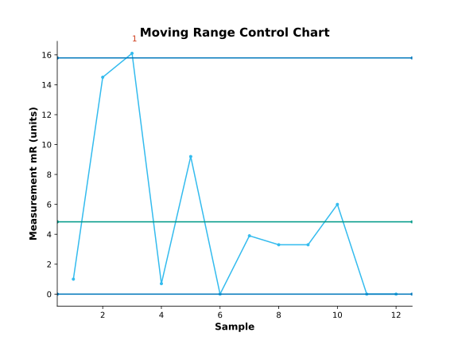
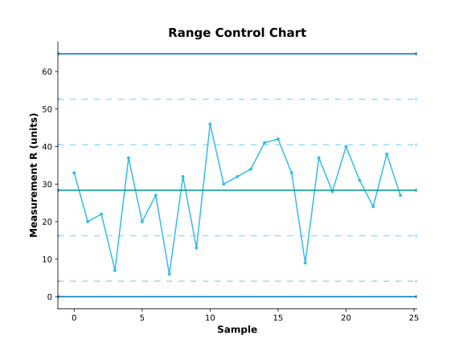
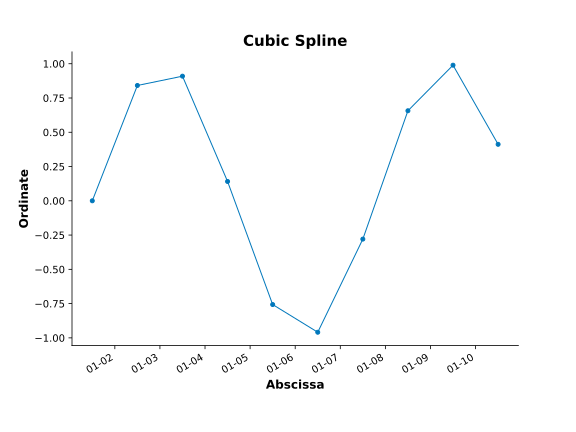
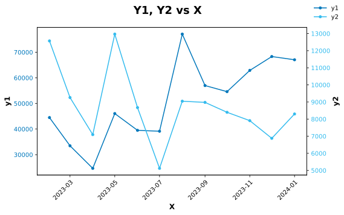

# In brevi

This repository contains a package of statistical and graphical functions
that I use in my work of making sense of data to create information
and understanding.

# To install #

Do this if this is your first-time installation. Ensure you have `git` installed.

```
pip3 install --user -e "git+https://github.com/gillespilon/datasense#egg=datasense"
```

# To update #

Do this if this is an update anytime after your first-time installation.

```
pip install --user --upgrade -e "git+https://github.com/gillespilon/datasense#egg=datasense"
```
# Documentation

This is built into the docstrings of the functions. These can be easily accessed using pydoc.

    pydoc datasense
    > ...
    > DESCRIPTION
    >     Tools for statistical, graphical, and predictive analysis:
    >     - Supervised machine learning
    >     - Six Sigma methodology
    >     - Regular expressions
    >     - Process variation
    >     - Excel file edits
    >     - Data Science
    >     - Automation
    >     - Analytics
    > ...
    >     Why this?
    >     - Equivalent Python functions that are available in R, SAS, JMP, Minitab
    >     - Other packages have limited process control analysis features.
    >     - Other packages are abandoned or inadequately supported.
    >     - Functions to support measurement system analysis.
    >     - Functions to simplify statistics, graphs, etc.
    >     - Functions to support process control charts.
    >     - Functions to support SQL functionality.
    >     - Develop a free open-source package.

    > PACKAGE CONTENTS
    >     automation
    >     control_charts
    >     graphs
    >     html_ds
    >     msa
    >     munging
    >     pyxl
    >     rgx
    >     sequel
    >     stats

    pydoc datasense.graphs
    pydoc datasense.graphs.probability_plot
    etc.

# Modules

## automation.py

Functions to automate things in daily life.

## control_charts.py

Create X, mR, Xbar, R control charts
Invoke Shewhart rules 1, 2, 3, 4

## graphs.py

Many graphs to simplify the use of matplotlib.

## html_ds.py

HTML and report functions.


## msa.py

Honest MSA reports on pandas DataFrames. This module is incomplete.

## munging.py

Many functions to munge data.

## pyxl.py

Many functions to simplify the use of openpyxl.

## rgx.py

Functions for specific applications of regex.

## sequel.py

Functions for specific applications to SQL.

## stats.py

Many functions for statistical analysis.

# Example scripts

In the [scripts](scripts/) directory, there are example scripts and data files.

- [XmR control charts](x_mr_control_charts.py)
- [XbarR control charts](xbar_r_control_charts.py)
- [Cubic spline for Y vs X line plot](cubic_spline.py)
- [Exponentially weighted average for Y vs X line plot](exponentially_weighted_average_example.py)
- [Piecewise natural cubic spline](scripts/piecewise_natural_cubic_spline.py)
- [Y1, Y2 vs X line charts with separate Y axes](plot_lineleft_lineright_x_y1_y2.py)

# Example graphs












# References

To cite this repository, please use:

@software{datasense,
  author      = {Gilles Pilon},
  title       = {datasense},
  url         = {https://github.com/gillespilon/datasense},
  version     = {0.2},
  date        = {2024-02-23}
}
